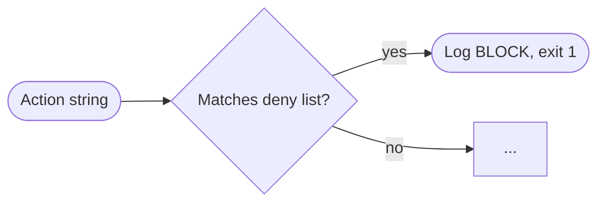
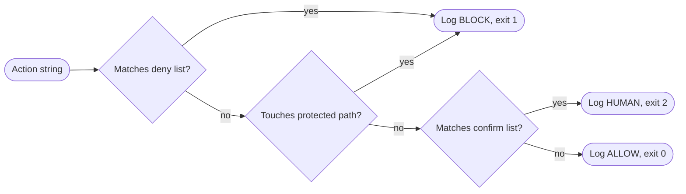
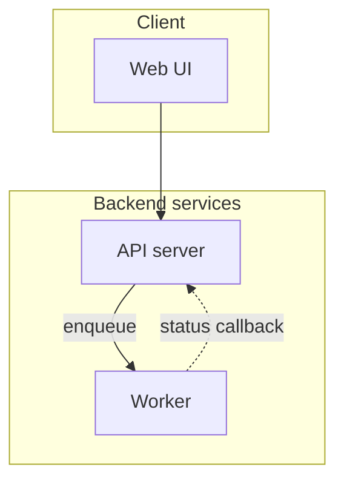
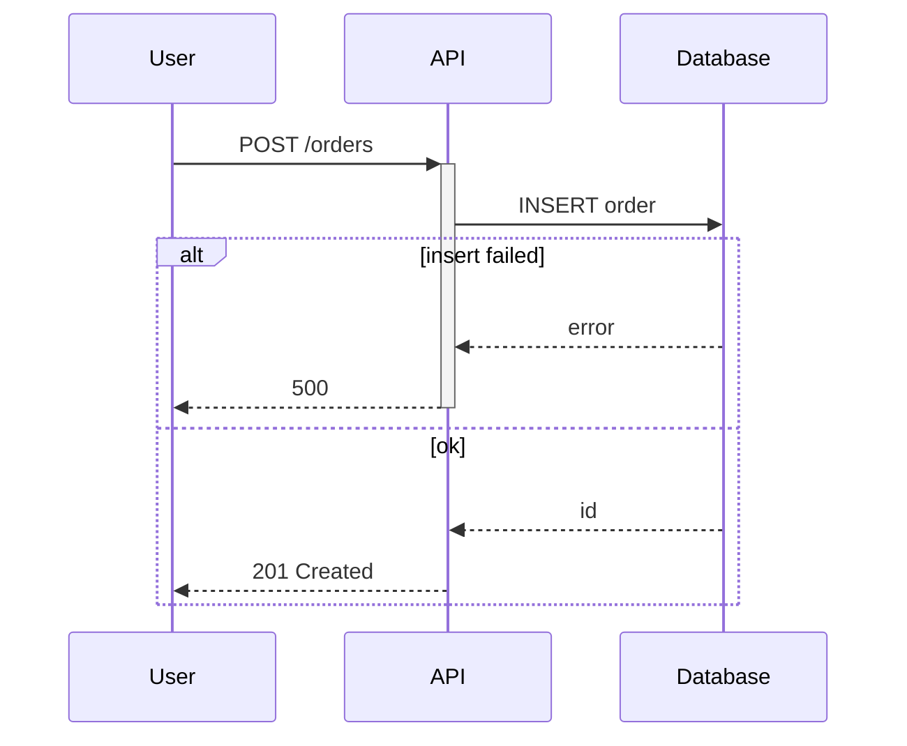
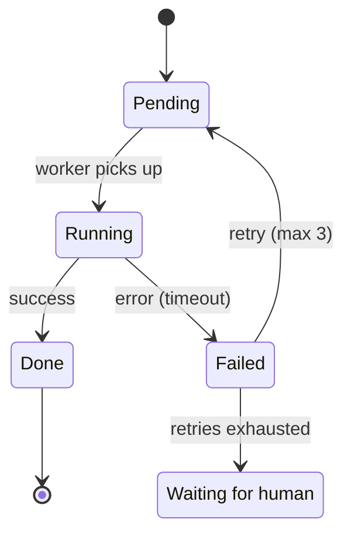
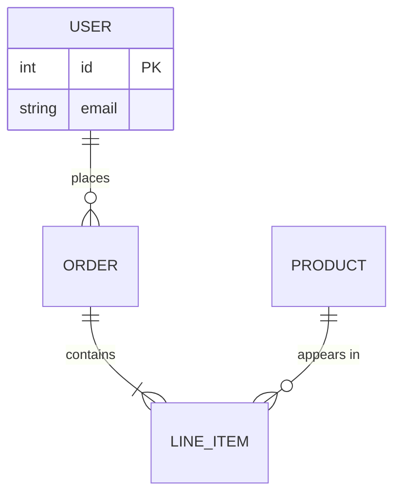
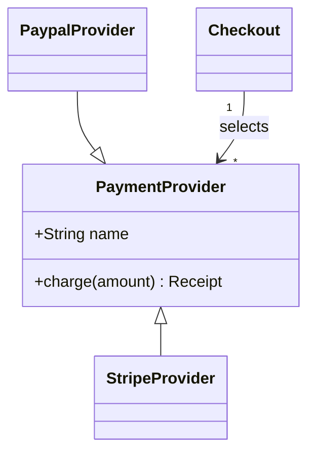
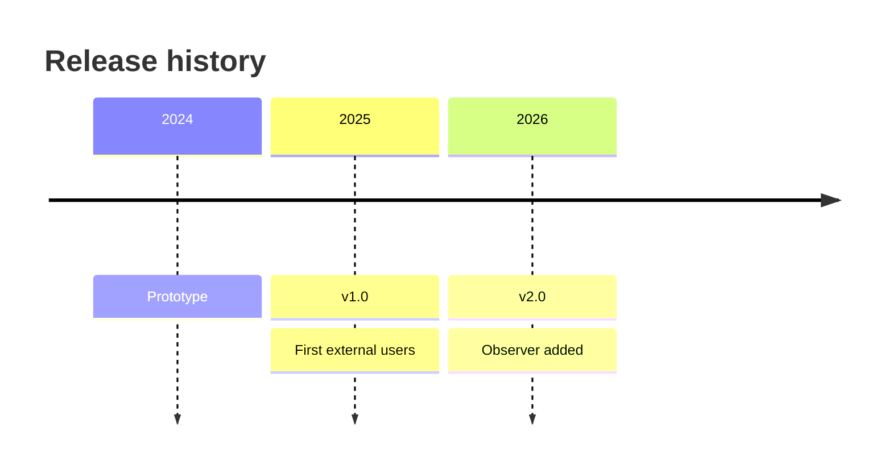

# Diagrams: detect, decide, ask, draw, validate

Read this when the material might contain a flow, a lifecycle, a data model or a topology, and before writing any Mermaid. It answers five questions in order: does the material contain diagrammable structure (detect), does that structure earn a diagram (decide), which of those choices the user should confirm (ask), which Mermaid type and shape to use (draw), and how to make sure it renders on GitHub (validate).

Mermaid fences are the diagram medium because GitHub renders them from plain Markdown, they diff in code review, and they can be regenerated from the same material later. The cost is that a diagram that fails to render shows a grey error box, which looks worse than no diagram at all. Everything below exists to get the benefit without paying that cost.

## Contents

1. [Detection: signals to diagram type](#1-detection-signals-to-diagram-type)
2. [Worthiness: when a diagram earns its place](#2-worthiness-when-a-diagram-earns-its-place)
3. [Diagrams in the grill-me and the skeleton](#3-diagrams-in-the-grill-me-and-the-skeleton)
4. [Granularity, naming and shapes](#4-granularity-naming-and-shapes)
5. [Placement and captions](#5-placement-and-captions)
6. [Mermaid-on-GitHub pitfalls](#6-mermaid-on-github-pitfalls)
7. [Canonical examples](#7-canonical-examples)
8. [Validation with scripts/check_mermaid.py](#8-validation-with-scriptscheck_mermaidpy)

## 1. Detection: signals to diagram type

Scan the material (notes, chat transcripts, source files, links) for the phrasings below while you build the outline, and record each hit as a candidate diagram together with the sentence, code or schema that triggered it. Candidates live in the `Diagrammables` bucket of the inventory (`references/ingest.md`, section 4), which is the only bucket the drawing step reads; an empty bucket means the doc gets no diagram. Chat transcripts are the richest source: people explain flows to each other in exactly these words (but see "Provenance in chats" in section 2 before trusting a sentence). Source code is the second richest: a function with several `if`/`return` branches, an enum of statuses, or a schema file each map directly to a type.

| Diagram type | Textual signals in the material | What it shows |
|---|---|---|
| `flowchart` (decision flow) | "if / otherwise / else", "when X then Y", "retry until", "first check ... then", "exit 0 / 1 / 2", "falls through to", ordered steps with branches | A process with decisions and outcomes |
| `flowchart` with `subgraph` (topology) | "service / module / component / layer", "A talks to / calls / reads from / publishes to B", "runs inside", "sits in front of" | Which parts exist and which depend on which |
| `sequenceDiagram` | "A sends / calls / requests ... B responds / returns", "waits for", "callback", "webhook", numbered steps where the *actor changes* between steps | Who talks to whom, in what order |
| `stateDiagram-v2` | "moves to / transitions to / becomes", named statuses (`pending`, `running`, `failed`), "can only ... while", "once it is X it cannot go back" | The states one thing can be in and what causes each change |
| `erDiagram` | "has many / belongs to", "table / record / row", "foreign key", schema or migration files, JSON shapes that reference each other by id | Entities, attributes and cardinalities |
| `classDiagram` | "extends / inherits / implements", "interface", "abstract", plugin or strategy hierarchies, methods and attributes named together | Types, members and inheritance |
| `timeline` | "in 2023 ... then in 2024", release history, "v1 introduced ... v2 removed", chronological events without durations | Ordered events; use only for history |
| `pie` | Actual proportions or counts in the material ("70% of requests are allowed") | Shares of a whole; use only when the numbers are in the material |

These seven types (flowchart in two shapes) are the allowed set; the linter accepts them silently. Other Mermaid types (`gantt`, `journey`, `mindmap`, `gitGraph`, `quadrantChart`, `sankey`, `xychart`, `block`, C4) render on github.com but are excluded from this skill because they rarely carry the kind of structure a README explains and their layouts are hard to keep legible; draw the underlying structure as a flowchart or a nested list. The linter warns when it sees one. Always write `flowchart`, not `graph`: same diagrams, newer parser, supports `direction` inside subgraphs. Pasted chats often contain `graph TD`; retype it.

### Disambiguation

The overlaps below come up constantly. Decide by asking what the reader will use the picture for.

- **Sequence vs flowchart.** Draw a `sequenceDiagram` when the interesting thing is *who* does each step and the messages between them (two or more participants, actor changes between steps, request/response pairs). Draw a `flowchart` when the interesting thing is *which path* is taken (decisions, loops, exits) and there is essentially one actor. "The script checks the deny list, then the protected paths, then the confirm list, and exits 0/1/2" is one actor with branches: flowchart. "The CLI calls the observer, the observer writes the log and returns an exit code, the CLI then prompts the human" is three participants exchanging messages: sequence. When a flow has both, draw the decision logic and name the participants in the prose, or split (section 4); if the choice is not obvious, it is a grill-me question (section 3).
- **State vs flowchart.** `stateDiagram-v2` when the nodes are *conditions one thing can be in* and edges are events ("job becomes `failed` on timeout"); flowchart when the nodes are *actions someone performs*. Test: if you can prefix every node with "is currently", it is a state diagram.
- **ER vs class.** `erDiagram` for persisted data (tables, documents, records) and cardinalities; `classDiagram` for code-level types with methods or inheritance. Config schemas with no behavior go to `erDiagram`.
- **Topology vs sequence.** A topology (flowchart with subgraphs) shows *that* A depends on B; a sequence shows *when* A calls B. Architecture section: topology. "What happens on a request" section: sequence. Both can coexist in one doc.

## 2. Worthiness: when a diagram earns its place

A diagram earns its place when it saves the reader from holding structure in their head. Draw when **both** hold:

- at least 3 participants, states, entities or steps, **and**
- at least 2 relationships that are not a straight line: a branch, a loop, a back-edge, a fan-out, a cross-cutting dependency, or a reply that carries a decision (an `alt`/`else`, an error path). A plain request/reply pair is one straight-line relationship, otherwise every three-service call chain would qualify.

Also draw, regardless of the counts, when the material itself contains a diagram (ASCII art, an existing Mermaid fence, "see the flow below") or when the user asks in this run for a diagram of a specific thing; then the only question is which type. The user's standing preference for diagrams is already built into these thresholds; it does not switch the test off.

Do not draw when the structure is a linear list (install, configure, run, verify: a numbered list is easier to follow while typing), when there is a single relationship (one sentence does it), when the nodes would be generic labels with no content from the material ("Input", "Process", "Output"), or when you would be guessing most of the edges.

| Material | Verdict |
|---|---|
| "Clone the repo, run `make setup`, copy `.env.example`, start the dev server" | No diagram: 4 linear steps. Numbered list. |
| "The script checks the deny list first and exits 1 on match; otherwise the protected paths, exit 1; otherwise the confirm list, exit 2; otherwise exit 0. Every outcome is logged." | Flowchart: 3 decisions, 3 distinct exits, two decisions sharing one outcome. |
| "Jobs are queued, picked up by a worker, and either complete or fail; failed jobs retry up to 3 times then go to dead-letter" | State diagram: 5 states, a retry loop, two terminal states. |
| "The frontend calls the API which reads Postgres" | No diagram: a straight chain of 3 with plain replies. A sentence. |
| "The API calls the auth service, which redirects the browser to the IdP; the IdP posts back a token which the API validates before replying" | Sequence: 4 participants, a redirect and a callback, a validation branch. |

**Budget.** One diagram per reader question, and rarely more than three in a README (a long guide or runbook can carry more, one per major section). When a rich transcript yields more candidates than that, keep the ones that answer the doc type's main question (section 3) and fold the rest into prose.

**Diagrams already in the inputs.** When an existing README or input doc contains a Mermaid fence, keep it only if every node and edge still traces to the current material; redraw it in the canonical shape if it does and the syntax is fragile; drop it (and say so in the chat summary) if it describes something the material no longer supports. Never carry a diagram forward unread.

**Material you cannot read.** Screenshots, whiteboard photos and image links referenced in a chat are absent material. Do not reconstruct a diagram from someone's description of a picture; note in Assumptions that the image was not available.

### Anti-fabrication

Only draw what the material states or unambiguously implies. A diagram carries more authority than prose, so a wrong edge misleads more than a wrong sentence.

- Every node and every edge must trace to a decision, a line of code, or a schema in the material. If you cannot point to it, leave it out. Start and end pseudo-states (`[*]`) are structural, not inferred.
- An edge that the material strongly implies but never states (a reply when only the call is described, a dependency that the code obviously needs) is marked as inferred in the way the diagram type allows, and the caption always says "inferred edges: ...":
  - `flowchart`: dashed arrow `-.->`, optionally with an `|inferred|` edge label.
  - `sequenceDiagram`: normal arrow plus `Note over A,B: inferred` right after it.
  - `stateDiagram-v2`, `erDiagram`, `classDiagram`: no dashed variant exists (the linter rejects `-.->` in state diagrams); put "(inferred)" in the transition or relationship label.
- Never invent participants to make a diagram look complete. A three-node diagram that is true beats a seven-node diagram that is half guessed.
- When sources contradict each other, draw the version the precedence in `references/interview.md` 4.6 selects (the repo artifact, then an explicit decision, then the later statement) and raise the discrepancy as a grill-me question; in headless mode apply that precedence and list the alternative in the Assumptions block. Never resolve a contradiction silently in the picture.

### Provenance in chats

In a transcript, a sentence is often a proposal, a hypothetical, or an assistant suggestion the user never accepted. Trace edges to *decisions*, not mentions:

- prefer the last statement in a thread over earlier ones; a later message that assumes a design counts as adopting it;
- treat assistant proposals as unconfirmed until the user adopts them ("yes, do that", or a later message builds on it);
- never draw a path that was explicitly discarded; when a chat contains both a proposed and a final flow, draw the final one and list the discarded alternative in the doc's open questions.

Example. Chat excerpt: *Assistant: "We could retry failed jobs up to three times before dead-lettering." User: "No, fail fast, a failed job goes straight to dead-letter." Assistant: "Done, no retry loop."* Resulting state diagram: `Running --> Failed`, `Failed --> [*]`, no `Failed --> Pending` edge, and Overview's design rationale notes that retries were discussed and rejected on <date>.

## 3. Diagrams in the grill-me and the skeleton

Diagrams are the most visible structural choice in the doc, so the candidate list goes through the interview like any other structural decision. The order is fixed so nothing is decided silently:

1. **While outlining**, build the candidate list: for each hit from section 1, record type, the section it would sit in, node count, the triggering sentence, and any source contradiction. Apply the worthiness test and the budget; mark each candidate "recommended" or "not recommended (reason)".
2. **During the interview**, ask one question for the whole list ("These three diagrams: include all, or drop the ER one?") with the recommended set listed first, then one question per non-obvious choice: a contradiction between sources, sequence vs flowchart when both fit, single diagram vs overview + detail when over the cap, which section owns a diagram that two sections could claim. Quote the triggering sentence in each question so the user can judge it, never ask about a diagram in the abstract.
3. **Draw only after the interview.** Anything discovered later goes in the Assumptions block, never in as a silent choice.

When the user escapes the interview ("go", "just write it"; `references/interview.md` section 10) or defers the diagram question ("skip", "you decide"), or the run is headless, the default is every recommended candidate, at most one diagram per section, contradictions resolved by the precedence in interview.md 4.6, and the Assumptions block lists what was assumed.

The doc types and section names below are the ones `references/structure.md` defines; its doc-type matrix carries the same diagram defaults.

| Doc type | Diagrams that usually earn a place | Skeleton section |
|---|---|---|
| README | One topology (flowchart with subgraphs) or the one central flow; a request sequence only if the project has a central one | How it works |
| Guide | Two to four across the stages: topology or flow in How it works, a sequence or state diagram in the stage that needs it | How it works, then the Walkthrough stage it explains |
| How-to | One decision flowchart or sequence, only when a step is unexplainable without it | How it works, kept short, before Steps |
| Runbook | The decision flowchart before step 1; a state machine of the thing being operated when it has named states | Procedure (before step 1), then How it works (after Procedure) |
| Onboarding | One system map (topology); an ownership map only when the material has one; skip ER and class unless the reader will edit that code | How it works |

## 4. Granularity, naming and shapes

**Node cap: 12 nodes per diagram, 20 edges.** Above that GitHub's render becomes a wall of tiny boxes that readers zoom past; 12 is roughly what fits legibly at README column width on a laptop. Subgraphs count their children, not themselves. Sequence diagrams: cap at 6 participants and 15 messages.

When the material exceeds the cap, split into **overview + detail**: an overview diagram whose nodes are groups (subsystem, phase, macro-state), at most 6 to 8 of them, in the architecture or "how it works" section; then one detail diagram per group that deserves it, in that group's own section, whose heading and caption reuse the group's exact name. Prefer splitting by reader question ("how does a request flow" vs "how does deployment work") over splitting by size alone.

**Direction.** `LR` for pipelines, request flows and anything the reader will describe with "then": it matches reading order and fits README width for up to ~7 nodes in a row. `TB` for hierarchies, decision trees with many branches, and layered topologies (client above backend above storage). Sequence and state diagrams have a fixed layout; do not fight it.

**Naming.** Use the exact term the prose uses, in the same casing, for every node label: if the doc says "the observer", the node is `Observer`, not `Guardrail`. Readers cross-reference by string matching. Node *ids* (the identifier before the bracket) are for you, not the reader: short, meaningful, letters, digits and underscores only (`deny`, `worker`, not `A`, `B`), and never reused for two different things across diagrams in one doc.

**Labels.** Keep node labels to 4 words; move detail into the prose. Put an edge label on every branch out of a decision node ("yes", "on timeout", "exit 2"), otherwise the reader cannot tell the branches apart.

**Shapes carry meaning, colors do not.** In flowcharts: stadium `([ ])` for entry and exit points, diamond `{ }` for decisions, rectangle `[ ]` for everything else. That is the whole vocabulary; it survives GitHub's light and dark themes, which `style` and `classDef` do not.

## 5. Placement and captions

Put the diagram **immediately before** the prose that walks through it, under the heading of the section it belongs to. The reader sees the shape first, then reads the explanation with the shape in view. Never put a diagram at the end of a section as decoration, and never put two diagrams back to back without prose between them.

Every diagram gets, in this order:

1. one plain sentence *before* the fence, ending in a colon, naming what the picture shows and its shape ("The observer runs three checks in a fixed order and exits on the first match:"), so the section still makes sense where the fence shows as raw code (email notifications, some mobile clients, PR diffs); the detailed walkthrough is the prose after the caption, not this sentence;
2. the fence, optionally opening with `accTitle: <name>` and `accDescr: <one line>` right after the type keyword (both render on GitHub and give screen readers a name);
3. one italic caption line *after* the fence: `*Figure: <what it is>. <Inference note, e.g. "inferred edges: status callback (from the 2026-03 chat)".>*`

````markdown
### Decision flow

The observer runs three checks in a fixed order and exits on the first match:



*Figure: observer decision order and exit codes. All edges are stated in `observer.sh`.*

Only an action that matches nothing is allowed. The deny list is checked first because ...
````

Number figures only when the doc has more than one and the prose refers to them by number.

## 6. Mermaid-on-GitHub pitfalls

GitHub renders Mermaid client-side in a sandboxed viewer with its own pinned Mermaid version and strict security settings; surfaces without that viewer (email, some apps, raw diffs) show the fence as code. Each pitfall below is a real render failure. Section 8 says which ones the linter catches; the rest you avoid by copying the canonical shapes in section 7.

**Unquoted labels with `( ) [ ] { } |`.** Brackets and braces are shape syntax, `|` is edge-label syntax. Quote any label that contains them. A colon is safe in flowchart labels; quoting it anyway is harmless.
```
wrong:  A[Read config (yaml)] --> B[Retry [max 3]]
right:  A["Read config (yaml)"] --> B["Retry [max 3]"]
```

**Lowercase `end` as a node id or in a bare subgraph title.** `end` closes a `subgraph`, so a node whose id is `end` is a parse error, and a bracket-less title such as `subgraph Back end` swallows the next line into the title. Inside a bracketed label or an edge label the word is plain text since Mermaid 10 (`b[The end]`, `a -->|at the end| b`), and `End` or `END` is fine anywhere.
```
wrong:  B --> end[Finish]          subgraph Back end
right:  B --> finish[End]          subgraph be [Back end]
```

**Node ids with spaces or punctuation.** Ids are identifiers; the label goes in the brackets.
```
wrong:  API Server --> Job Queue
right:  api[API Server] --> queue[Job Queue]
```

**Natural-language names in other types.** Chats describe states and entities in prose; the parsers want single words.
```
wrong:  [*] --> Waiting for human                (stateDiagram-v2)
right:  state "Waiting for human" as Waiting
        [*] --> Waiting
wrong:  USER ACCOUNT ||--o{ ORDER : has         (erDiagram)
right:  USER_ACCOUNT ||--o{ ORDER : has
safe:   participant ui as Web UI                (sequenceDiagram; spaces render, aliases keep ids short)
```

**Semicolons.** A bare `;` outside brackets ends a flowchart statement; inside a bracketed label (`a[Log; exit]`) or a sequence message it is plain text. Keep them inside labels or drop them.

**Subgraph titles.** Give every subgraph an explicit id plus a bracketed label so edges and `direction` can reference it; a title-only subgraph gets an id you cannot predict.
```
weak:   subgraph Backend services
right:  subgraph backend [Backend services]
```

**stateDiagram-v2 start, end and arrows.** `[*]` is the only start/end pseudo-state; `-->` is the only arrow; transition labels follow a colon.
```
wrong:  start --> Pending          [*] -.-> Pending
right:  [*] --> Pending            Pending --> [*]
```

**erDiagram relationships.** Exactly two cardinality tokens joined by `--` (identifying) or `..` (non-identifying): `|o` zero or one, `||` exactly one, `}o` zero or more, `}|` one or more, read outward from each entity. A label after the colon is required.
```
wrong:  USER 1--* ORDER            USER ||--o{ ORDER
right:  USER ||--o{ ORDER : places
```

**classDiagram arrows.** `<|--` inheritance, `*--` composition, `o--` aggregation, `-->` association, `..>` dependency, `..|>` realization. The head may sit on either side (`Animal <|-- Dog` and `Dog --|> Animal` are both valid); the head must point at the parent or owner. The real pitfall is a reversed head.
```
wrong:  Dog <|-- Animal            (reads: Animal inherits from Dog)
right:  Animal <|-- Dog
```

**sequenceDiagram blocks, activations, notes.** `alt`/`else`, `loop`, `opt`, `par`/`and`, `critical`, `break`, `rect` each close with `end` on its own line. `activate X` needs a matching `deactivate X`; the shorthand `A->>+B:` activates the receiver and `B-->>-A:` deactivates the sender. Notes take exactly the forms `Note left of X:`, `Note right of X:` and `Note over A,B:`.
```
wrong:  alt ok                     right:  alt ok
            A-->>B: 200                        A-->>B: 200
        else                               else error
            A-->>B: 500                        A-->>B: 500
        (missing end)                      end
```

**HTML and Markdown in labels.** `<br/>` works for line breaks; other tags are stripped or break the parse, and Markdown is not rendered.
```
wrong:  A[<b>Worker</b> `run()`]
right:  A["Worker<br/>run()"]
```

**Comments.** `%%` starts a comment and must be on its own line; a trailing `%%` after code is part of the line.

**Styling.** Omit `%%{init: ...}%%`, `style`, `classDef` and `linkStyle` entirely: GitHub forces its own theme, colors flip between light and dark mode, and `style` lines are the most common version-specific parse error. Meaning lives in shapes, labels and captions.

**A `#` in sequence message text.** The parser accepts it, but the renderer treats `#...` as the start of an entity code and drops the rest of the message. Write the word ("number 3", "step 3") instead; the linter warns.

**Other quick ones.** One diagram per fence. The type keyword is the first non-comment line after any `---` frontmatter, spelled exactly (`stateDiagram-v2`, not `statediagram`). Indent with spaces. Retype Unicode arrows and smart quotes pasted from chats as ASCII.

## 7. Canonical examples

Each block renders on GitHub today and is a fixture in `check_mermaid.py --selftest`. Copy the shape, replace the content.

**Flowchart with decisions** (stadium entry/exit, diamond decisions, labeled branches)


**Component topology with subgraphs** (dashed edge marks an inferred dependency)


**Sequence** (replies live inside the branch that produces them)


**State machine**


**Entity relationship**


**Class hierarchy** (fictional domain; draw classes only when the material has them)


**Timeline** (history only)


## 8. Validation with scripts/check_mermaid.py

Run the linter **after writing the document and before delivering it**, every time the doc contains at least one fence. The script lives in this skill's own `scripts/` directory; resolve the path from wherever SKILL.md was loaded (project `.claude/skills/docsmith/` or personal `~/.claude/skills/docsmith/`) rather than assuming the repo root:

```
python3 <skill dir>/scripts/check_mermaid.py path/to/DOC.md
```

It extracts every `mermaid` fence and prints one line per block (`file:line: type [ok|FAIL]`) followed by warnings and errors with document line numbers, then a total. Exit 0 means clean, 1 means at least one block has an error, 2 means usage or file error. `--selftest` runs the built-in fixtures (every canonical example above and every "right" line in section 6 pass; every "wrong" line the linter can see fails; the classDiagram head direction, semicolons and HTML tags are read-by-eye checks with no fixture) and is how you check the script itself after editing it.

This list is the single source of truth for what the linter sees; its fixtures were checked against Mermaid 11. **Errors** (the diagram fails to render or renders the wrong thing): unknown or misspelled type; empty block; odd double quotes (a quoted label may span lines); unbalanced `( )` `[ ]` per line and `{ }` per block (free text after `:` is ignored in sequence, state, timeline and pie); flowcharts: unquoted labels containing `( ) [ ] { } |`, a double quote inside an unquoted label, lowercase `end` as a node id or in a bare subgraph title, node ids with spaces, an unclosed `subgraph` or a stray `end`; sequences: unclosed or stray `alt`/`opt`/`loop`/`par`/`critical`/`break`/`rect`/`box`, an `else`/`and`/`option` outside its block, `deactivate` of a participant that was never activated, a Note without `: text`; state diagrams: multi-word state names, more than one transition on a line, any arrow other than `-->`; ER: malformed relationship tokens, missing label, multi-word entity names; pie: a data line that is not `"label" : number`. **Warnings** (renders, but wrongly or untidily): `graph` instead of `flowchart`, `stateDiagram` v1, the other Mermaid types outside the allowed set (gantt, journey, mindmap and the rest), `%%{init}%%`, `style`/`classDef`/`linkStyle`, an activation never closed, `start`/`end` used as state names instead of `[*]`, a `#` in sequence message text.

**It cannot see:** a wrong arrow direction, a missing branch label, a node the prose never mentions, semicolons inside text, HTML tags in labels, classDiagram heads on the wrong end, and exotic shape syntax it may misread. Check those by eye against section 6 for every block; that read-through is part of validation, not optional polish.

Fix every error, re-run until exit 0. Treat warnings as "fix unless you have a reason". Do not deliver with a failing block; if a block genuinely cannot be fixed, replace it with a nested list and say so in the Assumptions note. If the script cannot be run at all (no `python3`, Bash unavailable), do the section 6 checklist by hand for every block and note in Assumptions that Mermaid was not machine-checked.

If `mmdc` (mermaid-cli) is already on `PATH` you may render each block as an extra check (`mmdc -i DOC.md -o /tmp/render.md`, read its stderr); never install it, never ask the user to install it, never block delivery on it, and treat section 6 as the authority when the two disagree, since mermaid-cli's version differs from GitHub's.
