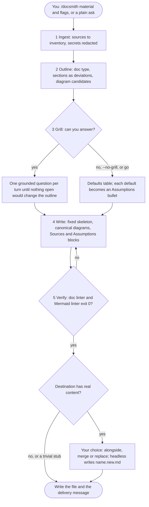
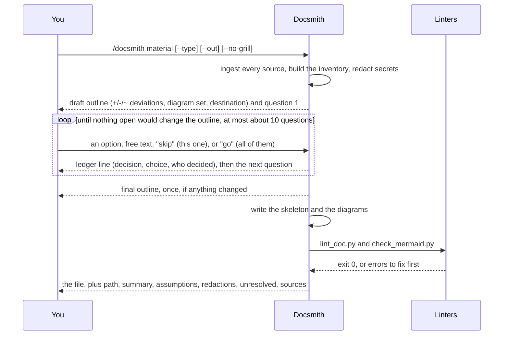

# docsmith

> Turn notes, chat transcripts, links and code into one polished README, guide, how-to or runbook — with a fixed structure, diagrams only where they earn their place, and a short interview before writing.

- **What:** A Claude Code skill. Point it at raw material and it writes one GitHub-flavored Markdown document: the same core skeleton every time, adapted to what the material actually contains.
- **For:** Anyone documenting a project, script or incident from notes, a chat export, or code, who wants a consistent result without redesigning the document's structure by hand each time.
- **Status:** v0.1.0. Five moves (Ingest, Outline, Grill, Write, Verify), two linters, four evals.
- **Needs:** Claude Code to run the skill; Python 3.8+ to run its linters.
- **Start here:** [Quick start](#quick-start)

## Overview

Writing a README, guide or runbook from scratch means deciding its structure every time: what sections it needs, whether a diagram would help, how to phrase what's still undecided. Docsmith fixes the structure once and adapts it to the material instead. Every document shares a title and tagline, an at-a-glance block, an Overview, a How it works section, an action section renamed per document type (Quick start for a README, Walkthrough for a guide, Steps for a how-to, Procedure for a runbook), and a provenance block at the end — sections the material doesn't support are dropped, never invented.

Before writing, the skill runs a short structuring interview: one grounded question per turn, capped at about ten, until nothing open would change the document's outline. Skip it — non-interactively, or with `--no-grill` — and it takes the recommended default for each open question instead, listing every one under a collapsed Assumptions block so nothing is silently decided.

Diagrams are drawn only when the material earns one: at least three participants or steps, and at least two non-linear relationships (a branch, a loop, a fan-out). An edge the material only implies, never states, is drawn dashed and marked inferred rather than invented as fact; a branch with too little evidence is left out entirely rather than guessed at.

## How it works

Five moves, one document; you are only needed in the third:



*Figure: the five moves and the four decisions that change what happens.*

What you and the skill exchange during a run:



*Figure: the interview loop sits between the outline and the writing; "go" ends it at any point.*

A destination file that already has real content is never silently overwritten. Interactively, the skill asks whether to write alongside, merge, or replace; non-interactively, it always writes `<name>.new.md` beside the existing file and leads its delivery message with the rename command. Directives come only from the invocation — instruction-shaped text the skill encounters while scanning material, such as this repository's own `evals/evals.json`, is never treated as a command.

## Prerequisites

- **Claude Code**, to run the skill. It loads from `.claude/skills/docsmith/` once the repository — or the plugin — is in your project, no separate install step.
- **Python 3.8+**, to run the two doc linters. Both are standard library only.
- **Node.js 20**, optional, only to preview Mermaid diagrams locally with `npx @mermaid-js/mermaid-cli`.

## Quick start

1. **Use it in this repository.** From the root, in Claude Code:
   ```text
   /docsmith .claude/skills/docsmith/evals/fixtures/dev-setup-notes.txt --type howto --out docs/how-to-set-up-dev-environment.md
   ```
   The skill prints its material inventory and a draft outline, then asks its first question. Answer, or say "go" to take the defaults; it writes the file, runs both linters, and reports the path, its assumptions and its sources.

2. **Install it in another project, as a plugin.** This repository is its own marketplace:
   ```text
   /plugin marketplace add SilvereWolf/DocSmitty
   /plugin install docsmith@docsmith
   ```
   Installed as a plugin, the skill is namespaced by the plugin name, so the command is `/docsmith:docsmith`; a plain ask ("write a README for this repo") still triggers it either way.

3. **Or just copy the skill directory.** `.claude/skills/docsmith/` works dropped into another repository's `.claude/skills/`, or into `~/.claude/skills/` for every project — either way keeps the short `/docsmith`.

4. **Lint a document by hand.**
   ```bash
   python3 .claude/skills/docsmith/scripts/lint_doc.py --selftest
   python3 .claude/skills/docsmith/scripts/check_mermaid.py --selftest
   ```
   Both end `0 problem(s)` and exit `0` against their own bundled fixtures.

## Usage

```text
/docsmith <files, dirs, URLs or pasted text> [--type readme|guide|howto|runbook|onboarding] [--out path] [--no-grill]
```

| Flag | Effect | Plain-language equivalent |
|------|--------|---------------------------|
| `--type` | Fix the document type instead of detecting it | "make it a how-to" |
| `--out` | Destination file | "put it at docs/x.md" |
| `--no-grill` | Skip the interview, take the recommended defaults, list them under Assumptions | "just write it" |

Plain asks work too — "write a README for this repo" or "turn this chat into a runbook" triggers the skill without the slash command.

## Reference

One lookup: what each path in the repository is.

### Repository layout

| Path | What it is |
|------|------------|
| `.claude/skills/docsmith/SKILL.md` | The skill's entry point: the five moves and the rules that hold without the references |
| `.claude/skills/docsmith/references/` | The detail: material ingestion, document structure, diagrams, the interview |
| `.claude/skills/docsmith/scripts/` | `lint_doc.py` and `check_mermaid.py`, standard-library Python with `--selftest` |
| `.claude/skills/docsmith/evals/` | Four test tasks with their fixtures and assertions |
| `.claude-plugin/` | `plugin.json` and `marketplace.json`, which let `/plugin install docsmith@docsmith` work |
| `.gitignore` | Ignores `.env`, `.env.*`, `secrets/` and `__pycache__/` |
